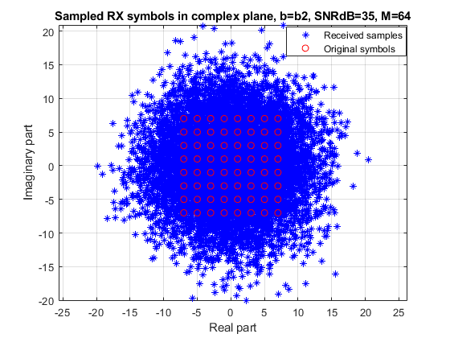

# COMM.SYS.300 COMMUNICATION THEORY
### Project Work:
Experimenting an Elementary Single-Carrier M-QAM-based Digital Communication Chain

## Author's details
Name: MASAUSO LUNGU

Email: masauso.lungu@tuni.fi

ID #: 151910942

## Task 1
* Plot the relevant responses and explain what you observe.

## Task 2 
* Vary the SNRdB value e.g. few values between 0 . . . 50, and see how that impacts the RX signal
spectrum. Provide relevant spectral examples and explain what you observe.

* Explain also the effects of multipath, why does the RX signal spectrum have clear fading
notches inside the passband ? To address the issue, plot the amplitude response of the multipath channel on a separate figure. 

* Vary also the multipath channel profile between the channels b1, b2, b3 and explain what you
observe (in terms of the RX signal spectrum).

## Task 3
* First momentarily omit the multipath (i.e. use the channel b1) and set SNR to 35 dB. Plot the
RX signal constellation and explain what you see.

* Then repeat by changing the SNR to 10 dB and 20 dB and plot and comment again the RX signal
constellation. Would the RX still be able to reliably decode/detect the received signal ?

* Then repeat by setting SNR back to 35 dB but now turning on the multipath channel. Experiment with both multipath channels b2 and b3. Plot always the RX signal constellation and try
to explain what you see.

* Then lower the SNR down to 10 dB. Again plot the RX signal constellations with all (multipath)
channels b1, b2 and b3 and explain what you see.

* Next, change the modulation order to M = 4, and repeat the above steps shortly. Comment on
the differences.

* Finally, change the modulation order to M = 64, and repeat the above steps shortly. Comment
on the differences.

## Task 4
*  First set Beta = 100 and plot the RX signal constellation and explain what you see.

* Then repeat by changing the Beta = 5000 and plot and comment again the RX signal constellation. Would the RX still be able to reliably decode/detect the received signal?
